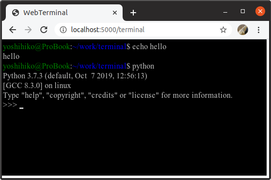

# Web Terminal

A software to execute Bash on a browser!

# Screenshot



# Requiremnts

* Git
* Python3


# Install

## Clone this software

```bash
git clone https://github.com/yoshihikoueno/WebTerminal
cd WebTerminal
```

## Install dependencies

Dependencies are listed in *requirements.txt*.

```bash
pip install -r requirements.txt
```


# Usage

## On the server

```bash
python3 run.py
```


## On the client

Open the browser and access <http://localhost:5000>.


# Supported features

* normal ascii key inputs and outputs
* ESC code to move cursor backward
* ESC code to change text color
* ESC code to change background color
* Auto resize the canvas when there's too many lines
* Redraw the content on window resize

# Ignored features

These features are **implemented** to ignore the feature.

* System command in ESC code
* Bell command

# Unsupported features

* Any key inputs with CTRL
* Function keys
* Any ESC codes which are NOT listed above


# NOTE

This software will start in *debugging mode* by default
mainly to limit the client to be **localhost**.

This behavior is to prevent other people from executing commands on the server.


# Known issues

* There's no session management.
* There are too many unsupported ESC codes.
* Redraw consumes too much resources.
* Security issues.
